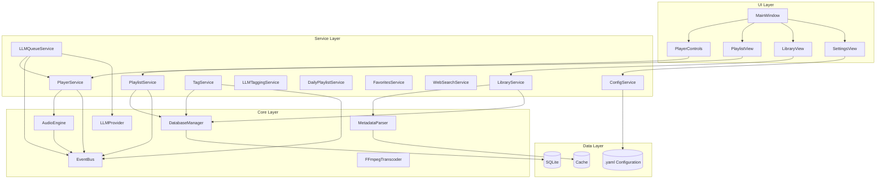
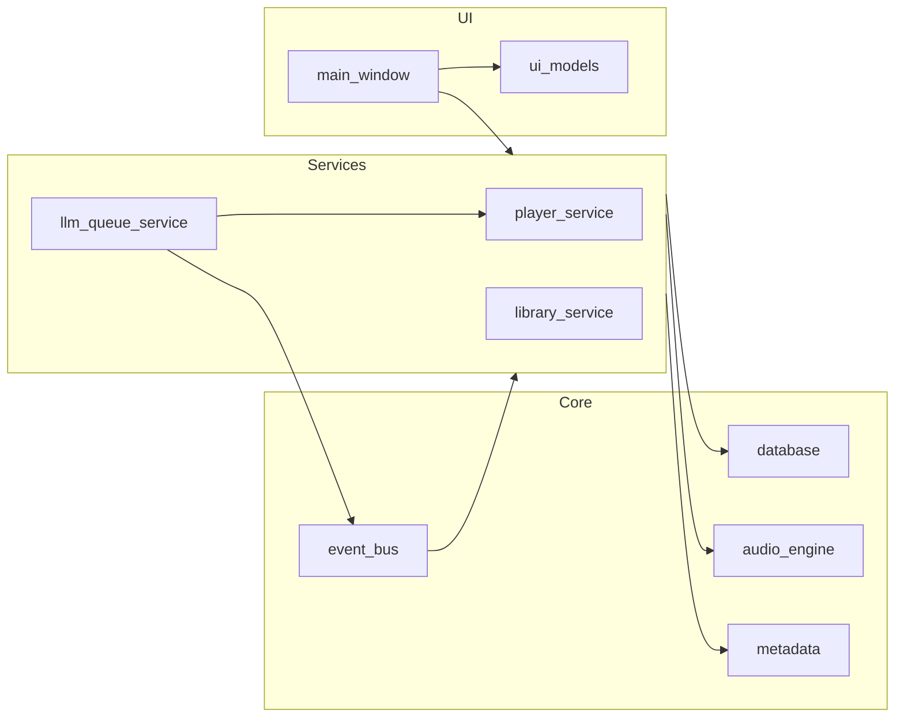
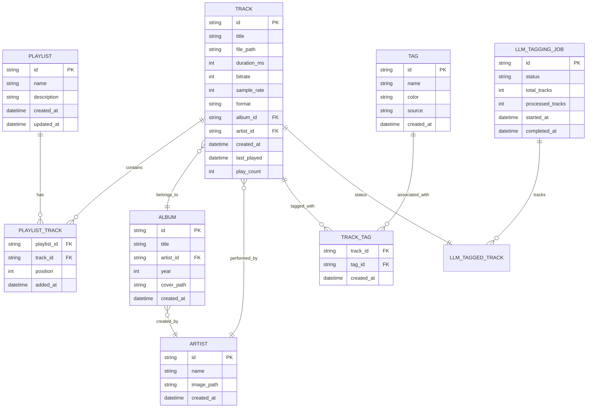
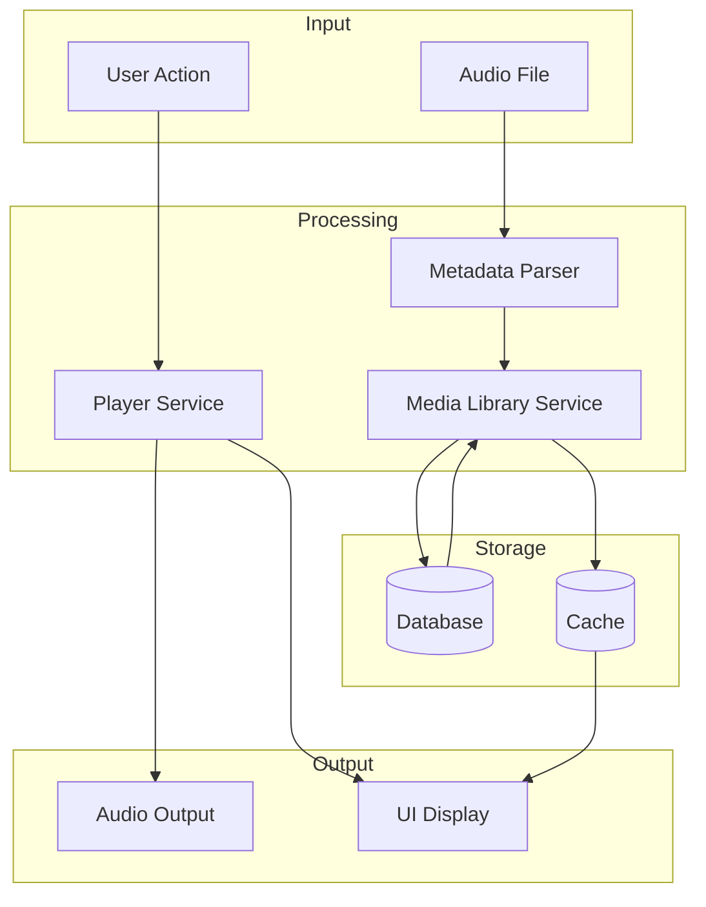
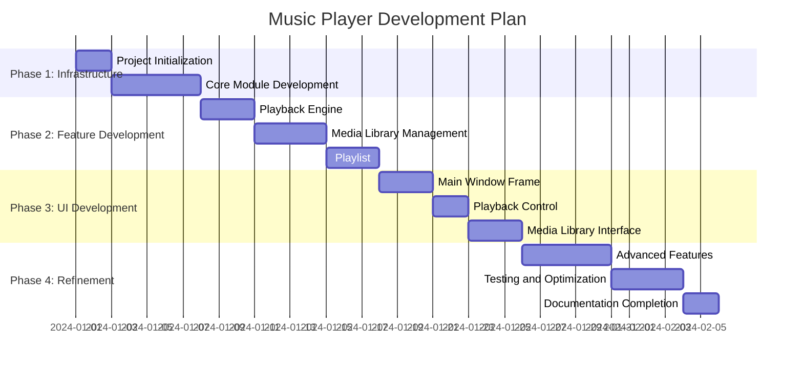

# 高质量音乐播放器 - 系统架构设计

## 1. 项目概述

### 1.1 项目目标

构建一个高质量、低耦合、可扩展的桌面音乐播放器应用程序，使用Python开发，支持多种音频格式，提供现代化的用户界面和丰富的功能。

### 1.2 核心特性

- **多格式支持**: MP3, FLAC, WAV, AAC, OGG, WMA, APE等
- **高品质播放**: 支持高保真音频播放，16bit/24bit, 44.1kHz-192kHz
- **现代UI**: 基于PyQt6的现代化界面设计
- **低耦合架构**: 模块化设计，各模块独立可替换
- **可扩展性**: 插件系统支持功能扩展

### 1.3 技术栈

| 组件 | 技术选型 | 说明 |
|------|----------|------|
| GUI框架 | PyQt6 | 成熟的跨平台GUI框架 |
| 音频引擎 | pygame/VLC | 高性能音频播放 |
| 元数据解析 | mutagen | 音频元数据读写 |
| 数据库 | SQLite | 轻量级本地数据库 |
| 配置管理 | YAML | 人类可读的配置格式 |

---

## 2. System Architecture

### 2.1 Overall Architecture Diagram



### 2.2 Layered Architecture Description

#### 2.2.1 UI Layer (Presentation Layer)

Responsible for user interface display and interaction, containing no business logic.

| Component | Responsibility | Dependency |
|-----------|----------------|------------|
| MainWindow | Main window layout management (split into `main_window_*.py`) | All UI components |
| PlayerControls | Play/Pause/Progress control | PlayerService |
| PlaylistView | Playlist display and operation | PlaylistService |
| LibraryView | Media library browsing and search | LibraryService |
| SettingsView | Application settings interface | ConfigService |
| ThemeManager | Theme management and DesignTokens | ConfigService |
| AudioSettingsDialog | Audio parameter settings (Backend/EQ/Crossfade) | ConfigService/PlayerService |
| FavoritesWidget | Favorites display and management | FavoritesService |
| DailyPlaylistWidget | Daily playlist generation interface | DailyPlaylistService |

#### 2.2.2 Service Layer

The core of business logic, coordinating interactions between modules.

| Component | Responsibility | Interface |
|-----------|----------------|-----------|
| PlayerService | Playback state management, playback queue | IPlayerService |
| PlaylistService | Playlist CRUD operations | IPlaylistService |
| LibraryService | Media library scanning, indexing, search | ILibraryService |
| TagService | Tag CRUD and relationship management | ITagService |
| LLMQueueService | Natural language-based queue reordering | ILLMQueueService |
| LLMTaggingService | Batch automatic tagging for tracks | ILLMTaggingService |
| DailyPlaylistService | Tag-based daily playlist generation | IDailyPlaylistService |
| FavoritesService | Favorites management | IFavoritesService |
| WebSearchService | Web search for lyrics/metadata | IWebSearchService |
| TagQueryParser | Natural language parsing for tag queries | - |
| ConfigService | Configuration read/write, hot updates | IConfigService |

#### 2.2.3 Core Layer

Low-level functionality implementation, providing foundational capabilities.

| Component | Responsibility | Features |
|-----------|----------------|----------|
| AudioEngineFactory| Audio engine factory | Supports backend auto-selection and fallback (Miniaudio->VLC) |
| MiniaudioEngine | High-fidelity audio engine | Gapless, Crossfade, EQ, ReplayGain |
| VLCEngine | VLC audio engine | Extensive format support |
| FFmpegTranscoder | Audio format transcoder | Handles unsupported formats for Miniaudio |
| MetadataParser | Metadata parsing and writing | Multi-format support |
| DatabaseManager | SQLite operation encapsulation | Connection pool, transactions, concurrency optimization |
| EventBus | Event publish-subscribe | Thread-safe, decoupled |
| LLMProvider | LLM provider abstraction | Multi-provider support (SiliconFlow/Gemini) |

#### 2.2.4 Data Layer

Persistent data storage.

| Component | Purpose |
|-----------|---------|
| SQLite | Media library, playlist storage |
| YAML Config | Application configuration persistence |
| Cache | Cover art, metadata cache |

---

## 3. Module Design

### 3.1 Directory Structure

```text
music/
├── scripts/                   # Build scripts
│   ├── build.py
│   ├── build.bat
│   └── build.sh
├── src/                       # Source code
│   ├── main.py               # Entry point
│   ├── core/                 # Core layer
│   │   ├── audio_engine.py
│   │   ├── database.py
│   │   ├── event_bus.py
│   │   └── metadata.py
│   ├── services/             # Service layer
│   │   ├── config_service.py
│   │   ├── daily_playlist_service.py
│   │   ├── favorites_service.py
│   │   ├── library_service.py
│   │   ├── llm_queue_service.py # LLM-enhanced services
│   │   ├── player_service.py
│   │   ├── playlist_service.py
│   │   └── web_search_service.py
│   ├── ui/                   # UI layer
│   │   ├── main_window.py
│   │   ├── models/           # UI data models (List Virtualization)
│   │   │   ├── track_list_model.py
│   │   │   └── track_table_model.py
│   │   └── widgets/
│   │       ├── library_widget.py
│   │       ├── player_controls.py
│   │       └── playlist_widget.py
│   └── models/               # Domain models (Data Layer)
│       ├── track.py
│       ├── album.py
│       └── artist.py
├── config/                   # Configuration files
│   └── default_config.yaml
└── tests/                    # Unit and integration tests
```

### 3.2 Module Dependencies



---

## 4. Design Principles

### 4.1 SOLID Principles Application

| Principle | Application |
|-----------|-------------|
| **Single Responsibility (SRP)** | Each module is responsible for one function, e.g., AudioEngine for playback only. |
| **Open/Closed (OCP)** | Supports extension via plugin system and abstract interfaces. |
| **Liskov Substitution (LSP)** | Audio backends (pygame/VLC) are interchangeable without affecting upper layers. |
| **Interface Segregation (ISP)** | Each service defines independent interfaces to avoid bloated interfaces. |
| **Dependency Inversion (DIP)** | Upper modules depend on abstractions rather than concrete implementations. |

### 4.2 Design Pattern Application

| Pattern | Scenario |
|---------|----------|
| **Singleton** | AudioEngine, DatabaseManager, EventBus |
| **Observer** | Event system, UI responding to playback state changes |
| **Strategy** | Audio backend switching, sorting strategies |
| **Factory** | Metadata parser creation |
| **Command** | Playback control commands, undo operations |
| **MVC** | UI and business logic separation |

---

## 5. Core Interface Definitions

### 5.1 Audio Engine Interface

```python
from abc import ABC, abstractmethod
from typing import Optional
from models.track import Track

class IAudioEngine(ABC):
    """Audio engine abstract interface"""
    
    @abstractmethod
    def load(self, track: Track) -> bool:
        """Load track"""
        pass
    
    @abstractmethod
    def play(self) -> None:
        """Start playback"""
        pass
    
    @abstractmethod
    def pause(self) -> None:
        """Pause playback"""
        pass
    
    @abstractmethod
    def stop(self) -> None:
        """Stop playback"""
        pass
    
    @abstractmethod
    def seek(self, position_ms: int) -> None:
        """Seek to position (ms)"""
        pass
    
    @abstractmethod
    def set_volume(self, volume: float) -> None:
        """Set volume (0.0 - 1.0)"""
        pass
    
    @abstractmethod
    def get_position(self) -> int:
        """Get current position (ms)"""
        pass
    
    @abstractmethod
    def get_duration(self) -> int:
        """Get total duration (ms)"""
        pass
```

### 5.2 Player Service Interface

```python
from abc import ABC, abstractmethod
from typing import List, Optional
from models.track import Track
from enum import Enum

class PlayMode(Enum):
    SEQUENTIAL = "sequential"      # Sequential playback
    REPEAT_ALL = "repeat_all"      # Repeat list
    REPEAT_ONE = "repeat_one"      # Repeat one
    SHUFFLE = "shuffle"            # Shuffle playback

class IPlayerService(ABC):
    """Player service abstract interface"""
    
    @abstractmethod
    def play_track(self, track: Track) -> None:
        """Play specified track"""
        pass
    
    @abstractmethod
    def play_pause(self) -> None:
        """Play/Pause toggle"""
        pass
    
    @abstractmethod
    def next_track(self) -> Optional[Track]:
        """Next track"""
        pass
    
    @abstractmethod
    def previous_track(self) -> Optional[Track]:
        """Previous track"""
        pass
    
    @abstractmethod
    def set_play_mode(self, mode: PlayMode) -> None:
        """Set playback mode"""
        pass
    
    @abstractmethod
    def set_queue(self, tracks: List[Track]) -> None:
        """Set playback queue"""
        pass
```

### 5.3 Event System Interface

```python
from abc import ABC, abstractmethod
from typing import Callable, Any
from enum import Enum

class EventType(Enum):
    # Playback events
    TRACK_STARTED = "track_started"
    TRACK_ENDED = "track_ended"
    TRACK_PAUSED = "track_paused"
    TRACK_RESUMED = "track_resumed"
    POSITION_CHANGED = "position_changed"
    VOLUME_CHANGED = "volume_changed"
    
    # Playlist events
    PLAYLIST_CHANGED = "playlist_changed"
    QUEUE_CHANGED = "queue_changed"
    
    # Media library events
    LIBRARY_SCAN_STARTED = "library_scan_started"
    LIBRARY_SCAN_PROGRESS = "library_scan_progress"
    LIBRARY_SCAN_COMPLETED = "library_scan_completed"
    
    # System events
    CONFIG_CHANGED = "config_changed"
    ERROR_OCCURRED = "error_occurred"

class IEventBus(ABC):
    """Event bus abstract interface"""
    
    @abstractmethod
    def subscribe(self, event_type: EventType, callback: Callable[[Any], None]) -> str:
        """Subscribe to event, returns subscription ID"""
        pass
    
    @abstractmethod
    def unsubscribe(self, subscription_id: str) -> None:
        """Unsubscribe"""
        pass
    
    @abstractmethod
    def publish(self, event_type: EventType, data: Any = None) -> None:
        """Publish event"""
        pass
```

---

## 6. 数据模型

### 6.1 核心实体关系



### 6.2 Data Flow Diagram



---

## 7. Non-functional Requirements

### 7.1 Performance Requirements

| Metric | Requirement |
|--------|-------------|
| Start-up Time | < 3 seconds |
| Memory Usage | < 200MB (idle) |
| Playback Latency | < 100ms |
| Media Library Scan | 1000 tracks/minute |
| Search Response | < 50ms |

### 7.2 Reliability Requirements

- Automatically restore playback state after crash.
- Database transactions ensure data consistency.
- Gracefully handle corrupted audio files.

### 7.3 Extensibility Requirements

- Supports hot-loading plugins.
- Supports theme switching.
- Supports multi-language.

---

## 8. Technical Risks and Mitigations

| Risk | Impact | Mitigation |
|------|--------|------------|
| Audio Decoding Compatibility | Some formats cannot be played | Use VLC backend as fallback |
| Large Media Library Performance | Scan and search slow down | Incremental updates, index optimization |
| Cross-platform Compatibility | Different system behavior | Comprehensive testing, platform-specific code isolation |
| Memory Leak | Unstable over long runs | Use weak references, timely resource release |

---

## 9. Development Plan

### 9.1 Milestone Planning



### 9.2 Version Planning

| Version | Feature Scope |
|---------|---------------|
| v0.1 | Basic playback, simple interface |
| v0.2 | Playlist, media library |
| v0.3 | Equalizer, lyrics |
| v1.0 | Full features, stable version |

---

## 10. Next Actions

1. Create project basic structure.
2. Implement core modules (EventBus, AudioEngine).
3. Implement service layer.
4. Develop UI interface.
5. Integration testing.
6. Performance optimization.

## 10.5 ģ�黯�ع��ɹ������¸��£�

### �ع�Ŀ��

- ������600�еĴ����ļ����Ϊ��С��ģ�飬��߿�ά����
- ����ģ������϶ȣ���ǿ����ɲ�����
- ��ѭ��һְ��ԭ��͸��ھ۵�������ԭ��

### �ع��ɹ�

| ԭģ�� | �ع���ģ�� | ���ģʽ | �������� |
|--------|------------|----------|----------|
| LibraryService (683��) | LibraryScanner, LibraryIndexer, LibraryQueryEngine, LibraryStatsManager | ���ģʽ | 66% |
| LLMQueueService (749��) | LLMQueueParser, LLMQueueExecutor, LLMSemanticSelector | ���ģʽ | 66% |
| LLMTaggingService (792��) | LLMTaggingJobManager, LLMTaggingEngine, LLMTaggingBatchProcessor | ���ģʽ | 64% |
| MiniaudioEngine (748��) | DeviceManager, Decoder, StreamProcessor, PlaybackController | ���ģʽ | 64% |
| MainWindow (674��) | MainWindowMenuManager, MainWindowNavigator, MainWindowLibraryManager, MainWindowSystemTrayManager, MainWindowUIBuilder | Э����ģʽ | 80% |

### �����Ľ�

1. **�̰߳�ȫ��ǿ**��ΪLLMQueueService�ı�ǩ��ѯ����������˫�ؼ������
2. **ѭ�������޸�**�����LibraryScanner��LibraryService֮���ѭ����������
3. **������ͬ��**���Ľ�MiniaudioEngine����Ƶ�豸�������Զ�ƥ�����
4. **ְ����������**��MainWindow���Ϊ5�������Ĺ������࣬��˾��ְ

### ��֤���

- ���Ĺ��ܲ���ȫ��ͨ����test_core.py, test_services.py��
- LLM���з������ͨ����test_llm_queue_service.py��
- ý�����񸽼Ӳ���ͨ����test_library_service_additional.py��
- ��������ȷ���ع��������ϸ��ھ۵����ԭ��

---
