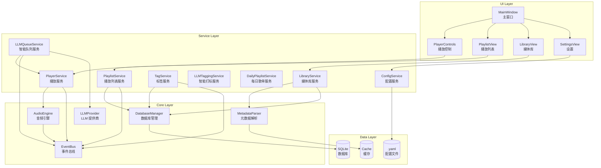
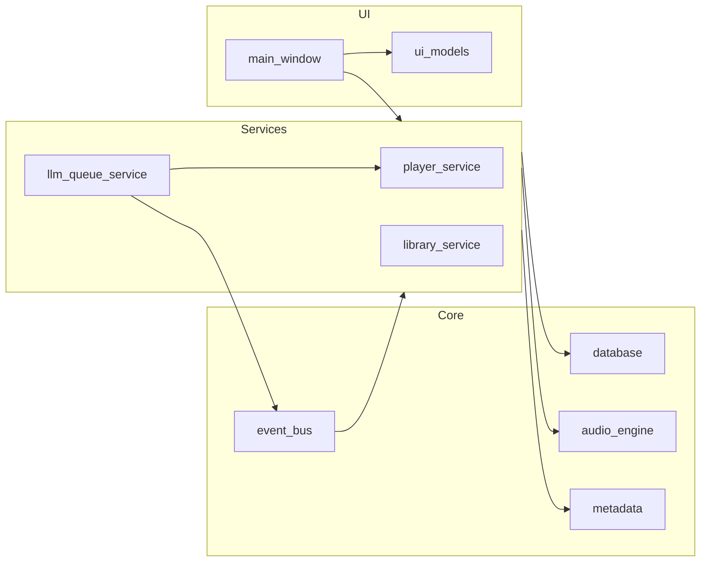
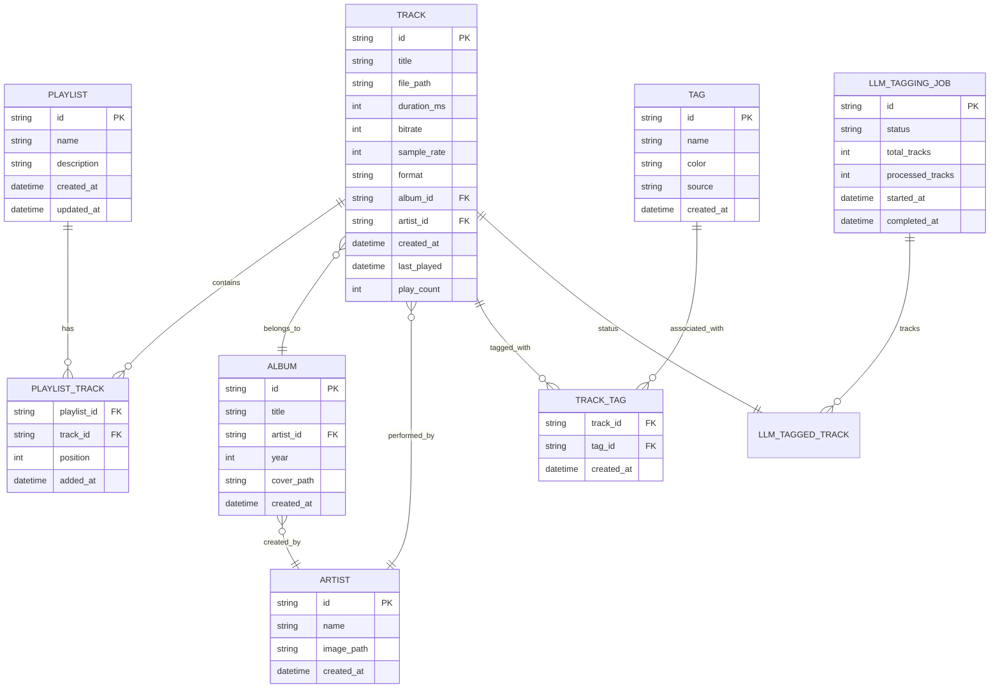
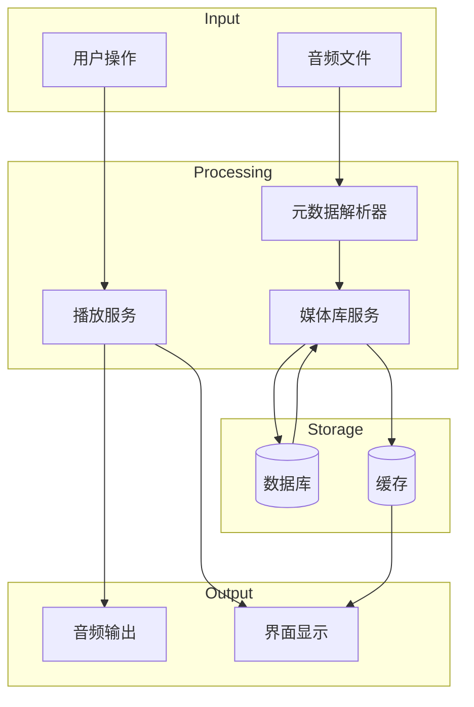
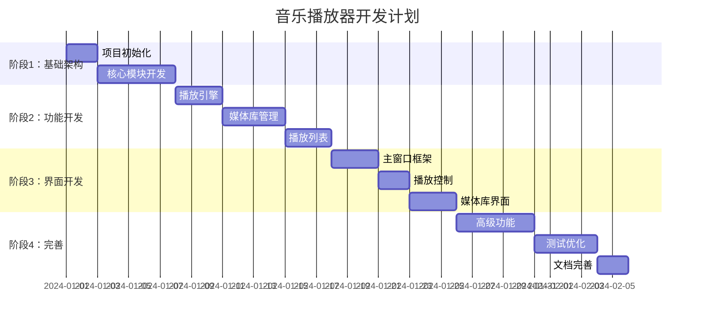

# 高质量音乐播放器 - 系统架构设计

## 1. 项目概述

### 1.1 项目目标

构建一个高质量、低耦合、可扩展的桌面音乐播放器应用程序，使用Python开发，支持多种音频格式，提供现代化的用户界面和丰富的功能。

### 1.2 核心特性

- **多格式支持**: MP3, FLAC, WAV, AAC, OGG, WMA, APE等
- **高品质播放**: 支持高保真音频播放，16bit/24bit, 44.1kHz-192kHz
- **现代UI**: 基于PyQt6的现代化界面设计
- **低耦合架构**: 模块化设计，各模块独立可替换
- **可扩展性**: 插件系统支持功能扩展

### 1.3 技术栈

| 组件 | 技术选型 | 说明 |
|------|----------|------|
| GUI框架 | PyQt6 | 成熟的跨平台GUI框架 |
| 音频引擎 | pygame/VLC | 高性能音频播放 |
| 元数据解析 | mutagen | 音频元数据读写 |
| 数据库 | SQLite | 轻量级本地数据库 |
| 配置管理 | YAML | 人类可读的配置格式 |

---

## 2. 系统架构

### 2.1 整体架构图



### 2.2 分层架构说明

#### 2.2.1 UI层 (Presentation Layer)

负责用户界面的展示和交互，不包含业务逻辑。

| 组件 | 职责 | 依赖 |
|------|------|------|
| MainWindow | 主窗口布局管理 | 所有UI组件 |
| PlayerControls | 播放/暂停/进度控制 | PlayerService |
| PlaylistView | 播放列表展示与操作 | PlaylistService |
| LibraryView | 媒体库浏览与搜索 | LibraryService |
| SettingsView | 应用设置界面 | ConfigService |
| AudioSettingsDialog | 音频参数设置 (Backend/EQ/Crossfade) | ConfigService/PlayerService |

#### 2.2.2 服务层 (Service Layer)

业务逻辑的核心，协调各模块之间的交互。

| 组件 | 职责 | 接口 |
|------|------|------|
| PlayerService | 播放状态管理、播放队列 | IPlayerService |
| PlaylistService | 播放列表CRUD操作 | IPlaylistService |
| LibraryService | 媒体库扫描、索引、搜索 | ILibraryService |
| TagService | 标签CRUD及关联管理 | ITagService |
| LLMQueueService | 基于自然语言的队列重排 | ILLMQueueService |
| LLMTaggingService | 批量自动为曲目打标 | ILLMTaggingService |
| DailyPlaylistService | 基于标签生成每日歌单 | - |
| TagQueryParser | 自然语言解析为标签查询 | - |
| ConfigService | 配置读写、热更新 | IConfigService |

#### 2.2.3 核心层 (Core Layer)

底层功能实现，提供基础能力。

| 组件 | 职责 | 特性 |
|------|------|------|
| AudioEngineFactory| 音频引擎工厂 | 支持后端自动选择与降级 |
| MiniaudioEngine | 高保真音频引擎 | Gapless, Crossfade, EQ, ReplayGain |
| VLCEngine | VLC音频引擎 | 广泛的格式支持 |
| MetadataParser | 元数据解析与写入 | 支持多格式 |
| DatabaseManager | SQLite操作封装 | 连接池、事务、并发优化 |
| EventBus | 事件发布订阅 | 线程安全、解耦 |
| LLMProvider | LLM 客户端抽象 | 多提供商支持 (SiliconFlow/Gemini) |

#### 2.2.4 数据层 (Data Layer)

数据持久化存储。

| 组件 | 用途 |
|------|------|
| SQLite | 媒体库、播放列表存储 |
| YAML配置 | 应用配置持久化 |
| 缓存 | 封面图片、元数据缓存 |

---

## 3. 模块设计

### 3.1 目录结构

```text
music/
├── scripts/                   # 构建脚本
│   ├── build.py
│   ├── build.bat
│   └── build.sh
├── src/                       # 源代码
│   ├── main.py               # 程序入口
│   ├── core/                 # 核心层
│   │   ├── audio_engine.py
│   │   ├── database.py
│   │   ├── event_bus.py
│   │   └── metadata.py
│   ├── services/             # 服务层
│   │   ├── config_service.py
│   │   ├── library_service.py
│   │   ├── llm_queue_service.py # LLM 增强服务
│   │   ├── player_service.py
│   │   └── playlist_service.py
│   ├── ui/                   # 界面层
│   │   ├── main_window.py
│   │   ├── models/           # UI 数据模型 (List Virtualization)
│   │   │   ├── track_list_model.py
│   │   │   └── track_table_model.py
│   │   └── widgets/
│   │       ├── library_widget.py
│   │       ├── player_controls.py
│   │       └── playlist_widget.py
│   └── models/               # 领域模型 (Data Layer)
│       ├── track.py
│       ├── album.py
│       └── artist.py
├── config/                   # 配置文件
│   └── default_config.yaml
└── tests/                    # 单元测试与集成测试
```

### 3.2 模块依赖关系



---

## 4. 设计原则

### 4.1 SOLID原则应用

| 原则 | 应用 |
|------|------|
| **单一职责 (SRP)** | 每个模块只负责一项功能，如AudioEngine只负责播放 |
| **开闭原则 (OCP)** | 通过插件系统和抽象接口支持扩展 |
| **里氏替换 (LSP)** | 音频后端可替换(pygame/VLC)而不影响上层 |
| **接口隔离 (ISP)** | 每个服务定义独立接口，避免臃肿 |
| **依赖倒置 (DIP)** | 上层模块依赖抽象而非具体实现 |

### 4.2 设计模式应用

| 模式 | 应用场景 |
|------|----------|
| **单例模式** | AudioEngine、DatabaseManager、EventBus |
| **观察者模式** | 事件系统，UI响应播放状态变化 |
| **策略模式** | 音频后端切换、排序策略 |
| **工厂模式** | 元数据解析器创建 |
| **命令模式** | 播放控制命令、撤销操作 |
| **MVC模式** | UI与业务逻辑分离 |

---

## 5. 核心接口定义

### 5.1 音频引擎接口

```python
from abc import ABC, abstractmethod
from typing import Optional
from models.track import Track

class IAudioEngine(ABC):
    """音频引擎抽象接口"""
    
    @abstractmethod
    def load(self, track: Track) -> bool:
        """加载音轨"""
        pass
    
    @abstractmethod
    def play(self) -> None:
        """开始播放"""
        pass
    
    @abstractmethod
    def pause(self) -> None:
        """暂停播放"""
        pass
    
    @abstractmethod
    def stop(self) -> None:
        """停止播放"""
        pass
    
    @abstractmethod
    def seek(self, position_ms: int) -> None:
        """跳转到指定位置（毫秒）"""
        pass
    
    @abstractmethod
    def set_volume(self, volume: float) -> None:
        """设置音量 (0.0 - 1.0)"""
        pass
    
    @abstractmethod
    def get_position(self) -> int:
        """获取当前播放位置（毫秒）"""
        pass
    
    @abstractmethod
    def get_duration(self) -> int:
        """获取音轨总时长（毫秒）"""
        pass
```

### 5.2 播放服务接口

```python
from abc import ABC, abstractmethod
from typing import List, Optional
from models.track import Track
from enum import Enum

class PlayMode(Enum):
    SEQUENTIAL = "sequential"      # 顺序播放
    REPEAT_ALL = "repeat_all"      # 列表循环
    REPEAT_ONE = "repeat_one"      # 单曲循环
    SHUFFLE = "shuffle"            # 随机播放

class IPlayerService(ABC):
    """播放服务抽象接口"""
    
    @abstractmethod
    def play_track(self, track: Track) -> None:
        """播放指定音轨"""
        pass
    
    @abstractmethod
    def play_pause(self) -> None:
        """播放/暂停切换"""
        pass
    
    @abstractmethod
    def next_track(self) -> Optional[Track]:
        """下一曲"""
        pass
    
    @abstractmethod
    def previous_track(self) -> Optional[Track]:
        """上一曲"""
        pass
    
    @abstractmethod
    def set_play_mode(self, mode: PlayMode) -> None:
        """设置播放模式"""
        pass
    
    @abstractmethod
    def set_queue(self, tracks: List[Track]) -> None:
        """设置播放队列"""
        pass
```

### 5.3 事件系统接口

```python
from abc import ABC, abstractmethod
from typing import Callable, Any
from enum import Enum

class EventType(Enum):
    # 播放事件
    TRACK_STARTED = "track_started"
    TRACK_ENDED = "track_ended"
    TRACK_PAUSED = "track_paused"
    TRACK_RESUMED = "track_resumed"
    POSITION_CHANGED = "position_changed"
    VOLUME_CHANGED = "volume_changed"
    
    # 播放列表事件
    PLAYLIST_CHANGED = "playlist_changed"
    QUEUE_CHANGED = "queue_changed"
    
    # 媒体库事件
    LIBRARY_SCAN_STARTED = "library_scan_started"
    LIBRARY_SCAN_PROGRESS = "library_scan_progress"
    LIBRARY_SCAN_COMPLETED = "library_scan_completed"
    
    # 系统事件
    CONFIG_CHANGED = "config_changed"
    ERROR_OCCURRED = "error_occurred"

class IEventBus(ABC):
    """事件总线抽象接口"""
    
    @abstractmethod
    def subscribe(self, event_type: EventType, callback: Callable[[Any], None]) -> str:
        """订阅事件，返回订阅ID"""
        pass
    
    @abstractmethod
    def unsubscribe(self, subscription_id: str) -> None:
        """取消订阅"""
        pass
    
    @abstractmethod
    def publish(self, event_type: EventType, data: Any = None) -> None:
        """发布事件"""
        pass
```

---

## 6. 数据模型

### 6.1 核心实体关系



### 6.2 数据流图



---

## 7. 非功能性需求

### 7.1 性能要求

| 指标 | 要求 |
|------|------|
| 启动时间 | < 3秒 |
| 内存占用 | < 200MB (空闲状态) |
| 播放延迟 | < 100ms |
| 媒体库扫描 | 1000首/分钟 |
| 搜索响应 | < 50ms |

### 7.2 可靠性要求

- 崩溃后自动恢复播放状态
- 数据库事务保证数据一致性
- 优雅处理损坏的音频文件

### 7.3 可扩展性要求

- 支持插件热加载
- 支持主题切换
- 支持多语言

---

## 8. 技术风险与应对

| 风险 | 影响 | 应对措施 |
|------|------|----------|
| 音频解码兼容性 | 某些格式无法播放 | 使用VLC后端作为备选 |
| 大型媒体库性能 | 扫描和搜索变慢 | 增量更新、索引优化 |
| 跨平台兼容性 | 不同系统表现不一 | 充分测试、平台特定代码隔离 |
| 内存泄漏 | 长时间运行不稳定 | 使用弱引用、及时释放资源 |

---

## 9. 开发计划

### 9.1 里程碑规划



### 9.2 版本规划

| 版本 | 功能范围 |
|------|----------|
| v0.1 | 基础播放、简单界面 |
| v0.2 | 播放列表、媒体库 |
| v0.3 | 均衡器、歌词 |
| v1.0 | 完整功能、稳定版本 |

---

## 10. 下一步行动

1. 创建项目基础结构
2. 实现核心模块 (EventBus, AudioEngine)
3. 实现服务层
4. 开发UI界面
5. 集成测试
6. 性能优化
