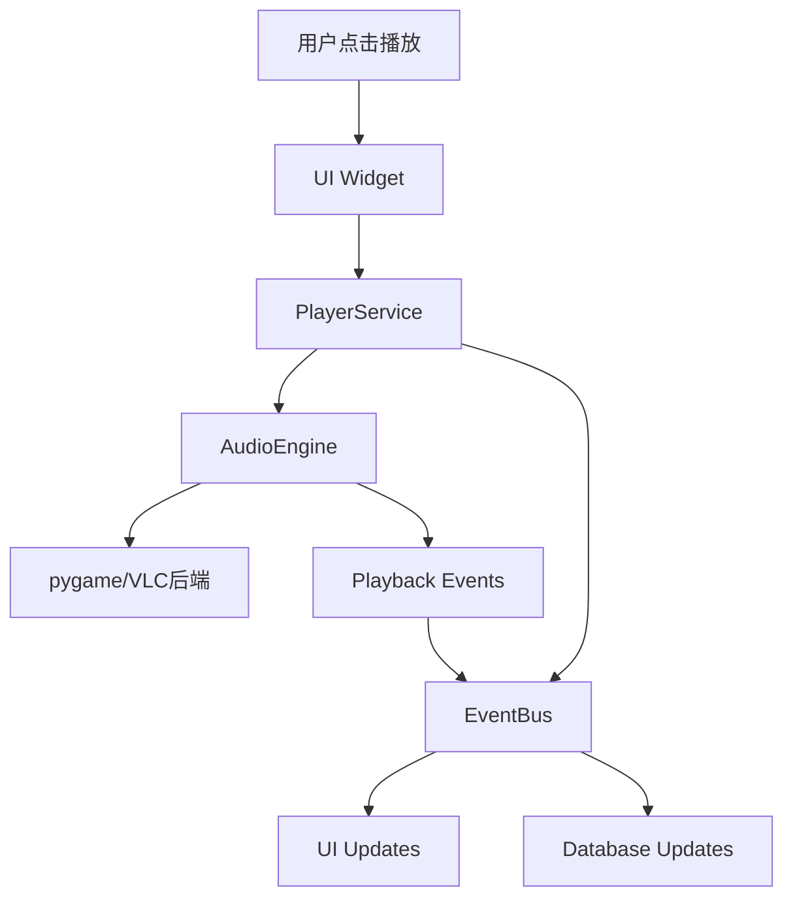
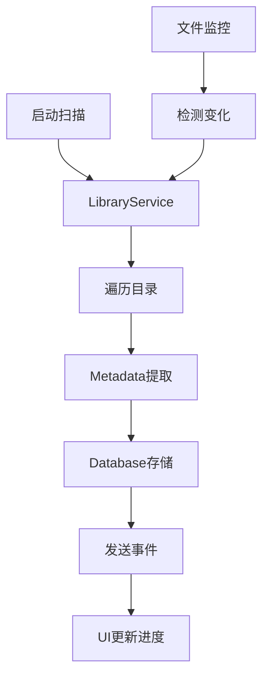
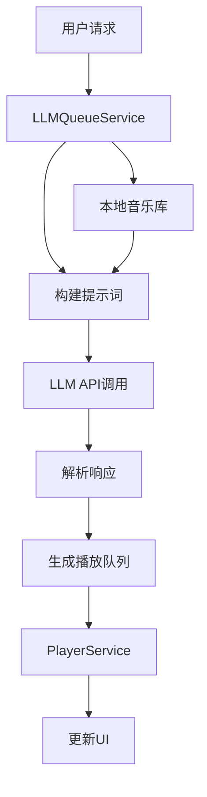

# Python Music Player 项目结构文档

## 项目概述

Python Music Player 是一个基于 PyQt6 的高质量桌面音乐播放器，采用现代化的分层架构设计，支持多种音频格式播放、智能队列管理和 LLM 辅助功能。

### 技术栈
- **GUI框架**: PyQt6
- **音频引擎**: pygame（支持多后端扩展）
- **数据库**: SQLite
- **元数据处理**: mutagen
- **配置管理**: PyYAML
- **AI集成**: SiliconFlow API (DeepSeek-V3)
- **测试框架**: pytest + pytest-qt

## 目录树结构

```
music-player/
├── README.md                     # 项目说明文档
├── requirements.txt              # Python依赖列表
├── version_info.txt              # 版本信息
├── MusicPlayer.spec              # PyInstaller打包配置
├── build.py                      # 自动化构建脚本
├── build.sh / build.bat          # 构建批处理脚本
├── build_config.yaml             # 构建配置文件
├── app.manifest                  # Windows应用清单
├── music_library.db              # SQLite数据库文件
├── .gitignore                    # Git忽略文件配置
├── .claude/                      # Claude开发工具配置
├── .vscode/                      # VSCode开发环境配置
│   └── settings.json
├── src/                          # 源代码目录
│   ├── __init__.py
│   ├── main.py                   # 应用程序入口点
│   ├── core/                     # 核心层
│   │   ├── __init__.py
│   │   ├── audio_engine.py       # 音频引擎抽象及实现
│   │   ├── database.py           # 数据库管理
│   │   ├── event_bus.py          # 事件总线系统
│   │   └── metadata.py           # 元数据提取
│   ├── services/                 # 服务层
│   │   ├── __init__.py
│   │   ├── config_service.py     # 配置管理服务
│   │   ├── library_service.py    # 音乐库管理服务
│   │   ├── llm_queue_service.py  # LLM队列管理服务
│   │   ├── player_service.py     # 播放控制服务
│   │   └── playlist_service.py   # 播放列表管理服务
│   ├── models/                   # 数据模型层
│   │   ├── __init__.py
│   │   ├── album.py              # 专辑数据模型
│   │   ├── artist.py             # 艺术家数据模型
│   │   ├── playlist.py           # 播放列表数据模型
│   │   └── track.py              # 音轨数据模型
│   └── ui/                       # 用户界面层
│       ├── __init__.py
│       ├── main_window.py        # 主窗口
│       ├── dialogs/              # 对话框组件
│       │   ├── __init__.py
│       │   ├── llm_settings_dialog.py      # LLM设置对话框
│       │   └── llm_queue_chat_dialog.py    # LLM队列聊天对话框
│       ├── widgets/              # 可复用UI组件
│       │   ├── __init__.py
│       │   ├── library_widget.py # 音乐库展示组件
│       │   ├── player_controls.py # 播放控制组件
│       │   └── playlist_widget.py # 播放列表组件
│       ├── styles/               # UI样式文件
│       │   └── dark_theme.qss    # 深色主题样式
│       └── resources/            # UI资源文件
│           └── icons/            # 图标资源
├── config/                       # 配置文件目录
│   └── default_config.yaml       # 默认配置文件
├── assets/                       # 静态资源目录
├── docs/                         # 文档目录
│   ├── api.md                    # API文档
│   ├── architecture.md           # 架构设计文档
│   ├── technical_design.md       # 技术设计文档
│   └── llm_queue_manager_plan.md # LLM队列管理计划
└── tests/                        # 测试代码目录
    ├── __init__.py
    ├── test_core.py              # 核心层测试
    ├── test_integration.py       # 集成测试
    ├── test_llm_queue_service.py # LLM队列服务测试
    └── test_services.py          # 服务层测试
```

## 架构设计

### 分层架构

项目采用严格的4层分层架构，确保关注点分离和系统可维护性：

```
┌─────────────────────────────────────┐
│           UI Layer                  │  # PyQt6界面层
│  ┌─────────────┐ ┌─────────────────┐ │
│  │ MainWindow  │ │   Dialogs       │ │
│  │  Widgets    │ │   Components    │ │
│  └─────────────┘ └─────────────────┘ │
├─────────────────────────────────────┤
│        Service Layer                │  # 业务逻辑层
│  ┌─────────────┐ ┌─────────────────┐ │
│  │PlayerService│ │LibraryService   │ │
│  │ConfigService│ │PlaylistService  │ │
│  │LLMQueueSv   │ │                 │ │
│  └─────────────┘ └─────────────────┘ │
├─────────────────────────────────────┤
│          Core Layer                 │  # 核心能力层
│  ┌─────────────┐ ┌─────────────────┐ │
│  │AudioEngine  │ │   EventBus      │ │
│  │Database     │ │   Metadata      │ │
│  └─────────────┘ └─────────────────┘ │
├─────────────────────────────────────┤
│          Data Layer                 │  # 数据持久层
│  ┌─────────────┐ ┌─────────────────┐ │
│  │   Models    │ │   SQLite DB     │ │
│  │  Entities   │ │   Files         │ │
│  └─────────────┘ └─────────────────┘ │
└─────────────────────────────────────┘
```

### 架构原则

1. **单向依赖**: 上层依赖下层，下层不依赖上层
2. **接口隔离**: 层间通过抽象接口通信
3. **事件驱动**: 使用EventBus实现解耦通信
4. **依赖注入**: 服务通过构造函数接收依赖

## 模块功能说明

### 核心层 (Core Layer)

#### audio_engine.py
音频引擎核心模块，提供抽象音频播放接口：
- `AudioEngineBase`: 音频引擎抽象基类
- `PygameAudioEngine`: pygame实现的音频引擎
- 支持播放状态管理、音量控制、播放位置跟踪

#### database.py
数据库管理模块：
- `DatabaseManager`: SQLite数据库单例管理器
- 支持连接池、事务管理、批量操作
- 自动处理数据库初始化和版本迁移

#### event_bus.py
事件总线系统：
- `EventBus`: 发布订阅模式的事件管理器
- 支持同步/异步事件分发
- 类型安全的事件定义和处理

#### metadata.py
元数据提取模块：
- 支持多种音频格式（MP3, FLAC, WAV, OGG等）
- 提取音频文件信息（时长、码率、采样率等）
- 专辑封面提取和处理

### 服务层 (Service Layer)

#### player_service.py
播放控制服务：
- 管理播放队列和播放状态
- 支持多种播放模式（顺序、循环、随机）
- 播放历史记录和统计

#### library_service.py
音乐库管理服务：
- 音乐文件扫描和导入
- 增量更新和监控变化
- 搜索和过滤功能

#### llm_queue_service.py
LLM队列管理服务（特色功能）：
- 智能队列生成和管理
- 基于用户偏好的音乐推荐
- 语义匹配和情感分析

#### playlist_service.py
播放列表管理服务：
- 播放列表的CRUD操作
- 播放列表排序和过滤
- 导入导出功能

#### config_service.py
配置管理服务：
- YAML配置文件管理
- 热更新配置
- 配置验证和默认值处理

### 数据模型层 (Models)

#### track.py
音轨数据模型：
```python
@dataclass
class Track:
    id: str
    title: str
    file_path: str
    duration_ms: int
    artist_id: Optional[str]
    album_id: Optional[str]
    # ... 其他字段
```

#### album.py
专辑数据模型：
- 专辑基本信息
- 关联艺术家和音轨
- 封面图片管理

#### artist.py
艺术家数据模型：
- 艺术家基本信息
- 关联专辑和音轨
- 艺术家图片管理

#### playlist.py
播放列表数据模型：
- 播放列表信息
- 音轨关联关系
- 排序和过滤条件

### 用户界面层 (UI Layer)

#### main_window.py
主窗口实现：
- 整体布局管理
- 菜单栏和工具栏
- 状态栏和进度显示

#### widgets/
可复用UI组件：
- `PlayerControls`: 播放控制组件（播放/暂停/上一首/下一首）
- `PlaylistWidget`: 播放列表显示组件
- `LibraryWidget`: 音乐库浏览组件

#### dialogs/
对话框组件：
- `LLMSettingsDialog`: LLM API配置对话框
- `LLMQueueChatDialog`: LLM队列管理聊天界面

#### styles/
样式文件：
- `dark_theme.qss`: Apple Music风格的深色主题
- 响应式布局支持

## 设计模式应用

### 1. 单例模式 (Singleton)
- `EventBus`: 全局事件管理器
- `DatabaseManager`: 数据库连接管理
- `AudioEngine`: 音频引擎实例

### 2. 观察者模式 (Observer)
- EventBus实现发布订阅机制
- UI组件响应事件更新
- 异步事件处理

### 3. 策略模式 (Strategy)
- 多种音频引擎后端
- 不同的播放模式策略
- 多种元数据解析器

### 4. 工厂模式 (Factory)
- 音频引擎创建工厂
- 元数据解析器工厂
- UI组件主题工厂

### 5. 依赖注入 (Dependency Injection)
- 服务通过构造函数接收依赖
- 便于单元测试和模块替换
- 降低耦合度

## 关键数据流

### 1. 音乐播放流程



### 2. 音乐库扫描流程



### 3. LLM队列管理流程



## 模块依赖关系

```
UI Layer
    ↓ (depends on)
Service Layer
    ↓ (depends on)
Core Layer
    ↓ (depends on)
Data Layer
```

### 依赖说明

1. **UI层依赖**：
   - 直接依赖Service层
   - 间接依赖Core层的EventBus
   - 不直接操作数据库

2. **Service层依赖**：
   - 依赖Core层的各个模块
   - 使用Data层的Model类
   - 通过EventBus通信

3. **Core层依赖**：
   - 独立的基础设施模块
   - 只依赖标准库和第三方库
   - 不依赖业务逻辑

4. **Data层依赖**：
   - 纯数据模型定义
   - 不依赖其他层

## 特色功能实现

### 1. LLM智能队列管理
- 基于DeepSeek-V3的智能推荐
- 语义理解和情感匹配
- 支持自然语言交互

### 2. 多音频格式支持
- 使用mutagen处理元数据
- pygame音频引擎后端
- 可扩展的音频引擎架构

### 3. 现代化UI设计
- Apple Music风格的深色主题
- 响应式布局设计
- 流畅的动画效果

### 4. 高性能数据库操作
- SQLite连接池
- 批量操作优化
- 索引优化查询

## 配置管理

配置文件结构 (default_config.yaml)：

```yaml
app:          # 应用基础配置
audio:        # 音频引擎配置
library:      # 音乐库配置
llm:          # LLM功能配置
playback:     # 播放行为配置
shortcuts:    # 快捷键配置
ui:           # 界面配置
```

## 构建和部署

### 开发环境
```bash
# 安装依赖
pip install -r requirements.txt

# 运行应用
python src/main.py

# 运行测试
python -m pytest tests/
```

### 打包部署
```bash
# Windows
./build.bat

# Linux/Mac
./build.sh
```

## 总结

Python Music Player项目采用清晰的分层架构，各模块职责明确，具有良好的可维护性和可扩展性。项目特色在于将传统音乐播放器与现代AI技术结合，提供智能化的音乐管理体验。通过合理的设计模式应用和模块化设计，为后续功能扩展奠定了良好基础。